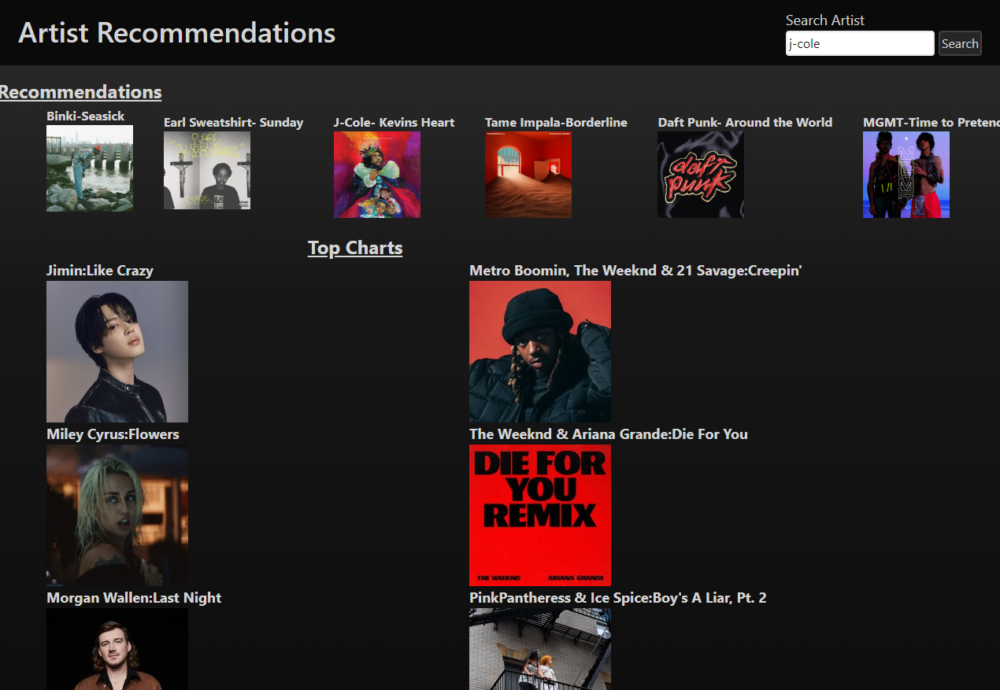
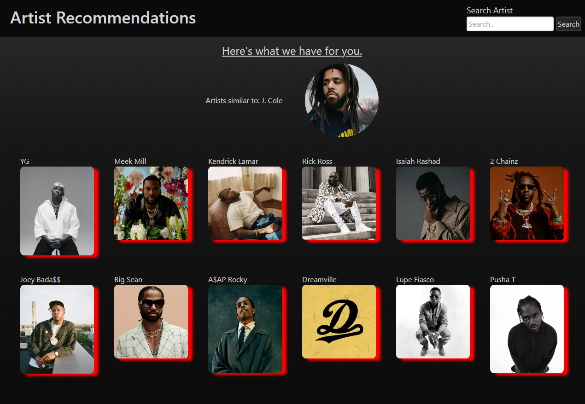
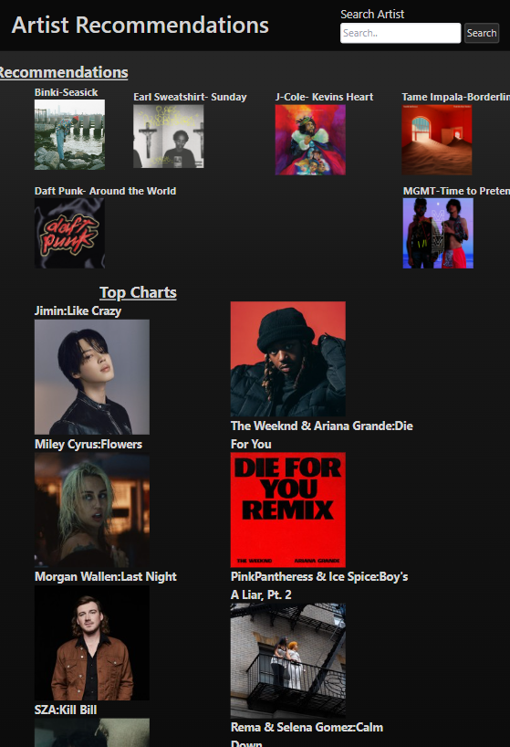
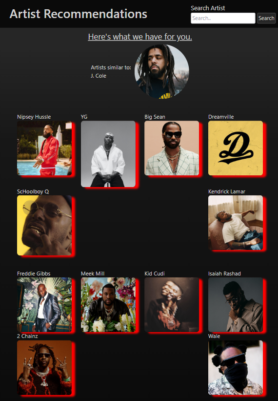
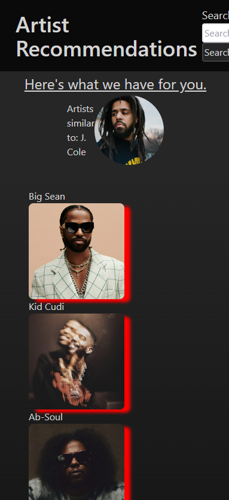
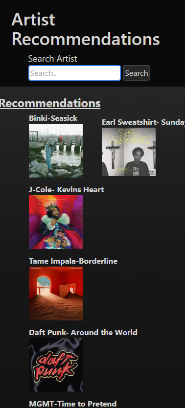

# SONG IDENTIFIER

song identifier is a website created to give users recommendations based off artist they like, as well as recomendations and a billboards chart list
## User story 
**AS** a music enthusiast
**I WANT** a website that gives me artist recommendations
**SO THAT** i can get a list of recommendations based off my input

## technologies
rapid API , spotify API, billboard 100 API, tailwind stylesheet 
 ### API links ###
## Features##
recommendations list, list of top charts, generate random list based on user input, regenerate new list without having to re input parameters, link to songs

